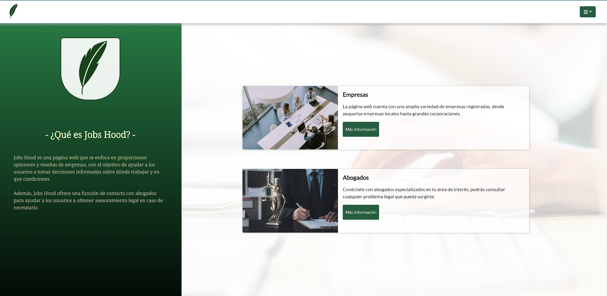
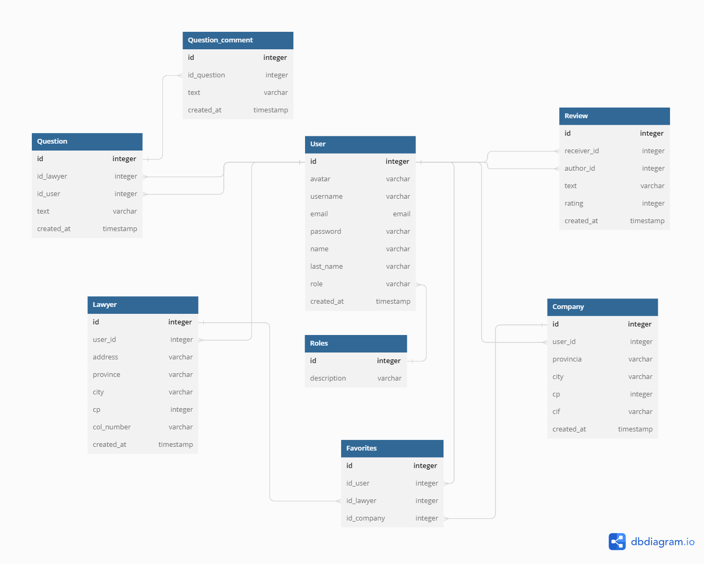

# Proyecto Jobs Hood
Este proyecto es una aplicación web desarrollada en React.js. Se llama Jobs Hood y su objetivo principal es proporcionar opiniones y reseñas de empresas para ayudar a los usuarios a tomar decisiones informadas sobre dónde trabajar y en qué condiciones.

Los usuarios podrán registrarse en la web como empleados, empresas o abogados y podrán participar de las funcionalidades de la red social.


### Esquema de la base de datos

 

3-06-2023  MEJORAS JOBS HOOD:
# - Futuras funcionalidades-
- Listado de favoritos de opiniones o respuestas.
- Mensajes Privados entre usuarios.
- Notificaciones por email de la plataforma hacia los usuarios. (reviews o preguntas por contestar) 

## Contribuciones
Las sugerencias y aportaciones son siempre bienvenidas.  

Puedes hacerlo de dos maneras:

1. Abriendo una issue
2. Crea un fork del repositorio
    - Crea una nueva rama  
        ```
        $ git checkout -b feature/nombreUsuario-mejora
        ```
    - Haz un commit con tus cambios 
        ```
        $ git commit -m 'feat: mejora X cosa'
        ```
    - Haz push a la rama 
        ```
        $ git push origin feature/nombreUsuario-mejora
        ```
    - Abre una solicitud de Pull Request


